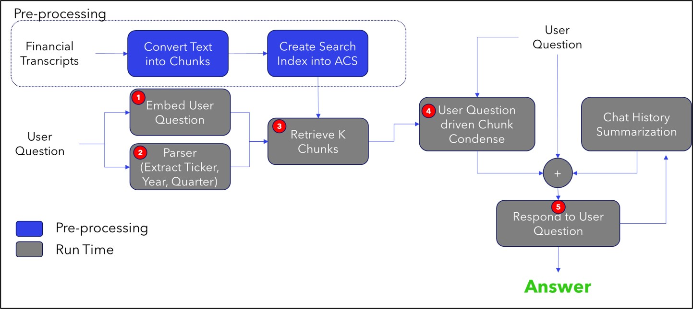

# Project

This README provides a comprehensive guide on implementing a question-answering system using the Retrieval Augmentation Generation (RAG) pattern on Microsoft (MSFT) transcripts. The process leverages Azure Cognitive Search (ACS) for creating a vector database and Azure Form Recognizer for processing raw documents.

Before commencing the project, ensure that you add the necessary keys to example.env in the root directory and rename it as llm.env. Specifically, we require keys for Azure Form Recognizer, Azure Open AI, and Azure Cognitive Services.

## Large Language Model (LLM) application

In this project, we've employed the RAG approach to develop an LLM application. This involves retrieving context from the database using a human query, augmenting the context, and then prompting GPT-style models to generate an answer. However, we encountered two key challenges with the basic RAG implementation:

1. Context Size: At times, the context retrieved from the database is excessively large and doesn't fit within the prompt for GPT-style models. To address this, we utilized an intermediate GPT call to summarize or extract the pertinent information from the retrieved context.

2. User Queries Requiring Chat History: Some user queries necessitate the access to previous chat history for accurate responses. To tackle this, we summarize the chat history and augment it with the human query and context.

To address these challenges, we implemented the architecture shown in the figure below. The chatBot class in chatBot.py implements different functionalities shown in the figure.



## How to Run

### Creating a Vector Database on Azure Cognitive Search (ACS)

Crating a vector database is a four step process outlined below: 

1. `step0_data_preprocessor.ipynb` accesses the DATA\ word docs and convert them to PDF to be used by the Azure Form Recognizer in the next step.
2. `step1_chunk_and_extract.ipynb` chunks and extracts PDF files using Azure Form Recognizer and save to .csv files.
3. `step2_embed.ipynb` reads and embeds using Azure OpenAI and saves to .csv files.
4. `step3_db_storing_vectorsearch.ipynb` reads and inserts data into ACS and shows examples of various searching capabilities using ACS hybrid search.

### Running LLM application
To run the LLM application, execute the llm_app.py file.

#### Deployment with streamlit

1. Run locally

```
streamlit run main.py --server.port 8000
```

2. Build docker. Since the chatBot.py and environment.yaml files are at the parent directory, the Dockerfile only works if you run the command from the parent directory.   
```
docker build -t bot:v1 -f samples_e2e/financial_transcripts/Dockerfile .
docker run --rm -p 8000:8000 bot:v1
```

Go to an open web browser and type `localhost:8000`

## Contributing

This project welcomes contributions and suggestions.  Most contributions require you to agree to a
Contributor License Agreement (CLA) declaring that you have the right to, and actually do, grant us
the rights to use your contribution. For details, visit https://cla.opensource.microsoft.com.

When you submit a pull request, a CLA bot will automatically determine whether you need to provide
a CLA and decorate the PR appropriately (e.g., status check, comment). Simply follow the instructions
provided by the bot. You will only need to do this once across all repos using our CLA.

This project has adopted the [Microsoft Open Source Code of Conduct](https://opensource.microsoft.com/codeofconduct/).
For more information see the [Code of Conduct FAQ](https://opensource.microsoft.com/codeofconduct/faq/) or
contact [opencode@microsoft.com](mailto:opencode@microsoft.com) with any additional questions or comments.

## Trademarks

This project may contain trademarks or logos for projects, products, or services. Authorized use of Microsoft 
trademarks or logos is subject to and must follow 
[Microsoft's Trademark & Brand Guidelines](https://www.microsoft.com/en-us/legal/intellectualproperty/trademarks/usage/general).
Use of Microsoft trademarks or logos in modified versions of this project must not cause confusion or imply Microsoft sponsorship.
Any use of third-party trademarks or logos are subject to those third-party's policies.


